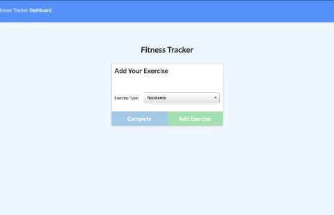

# Fitness Tracker

[](https://opensource.org/licenses/MIT)
[](https://www.linkedin.com/in/maranda-zwieschowski/)

<br />
<p align="center">
  <h3 align="center">Fitness Tracker </h3>

  <p align="center">
    This app utilizes MongoDB and the Mongoose library so a user can track their fitness info. Click 
    [] to view the deployed app.

    <br />
    <a href="https://github.com/marandaz/fitnessTracker"><strong>Explore the docs »</strong></a>
    <br />
    <br />
    <a href="https://github.com/marandaz/fitnessTracker">View Demo</a>
    ·
    <a href="https://github.com/marandaz/fitnessTracker/issues">Report Bug</a>
    ·
    <a href="https://github.com/marandaz/fitnessTracker/issues">Request Feature</a>
  </p>
</p>


## Table of Contents

* [About the Project](#about-the-project) 
* [Installation](#installation)
* [Usage](#usage)
* [Contributing](#contributing)
* [License](#license)
* [Contact](#contact)
* [Acknowledgements](#acknowledgements)


## About The Project
 


This command-line application uses node, inquierer and MySQL to manage a comanpy's employees. It allows a user to:
* Add departments, roles, employees
* View departments, roles, employees
* Update employee roles

## Installation

For this project you will need to install inquirer by inputing npm i inquirer and console.table.

1. Clone the repo
```sh
git clone https://github.com/marandaz/fitnessTracker.git
```
2. Install NPM packages
```sh
npm install
```
3. Run seed data
```sh
npm run seed
```
 
## Usage
 
To use this application, you need to install dependencies using node.js and run seed data during development/initial set up. This app uses mongoose to create, read, and update fitness info. Mongoose is also used to create a schema for the data so we have data to add to the MondoDB.


## Contributing

Contributions are what make the open source community such an amazing place to be learn, inspire, and create. Any contributions you make are **greatly appreciated**.

1. Fork the Project
2. Create your Feature Branch (`git checkout -b feature/AmazingFeature`)
3. Commit your Changes (`git commit -m 'Add some AmazingFeature'`)
4. Push to the Branch (`git push origin feature/AmazingFeature`)
5. Open a Pull Request


## License

Distributed under the MIT License.

## Contact

Maranda Zwieschowsi - mrzwies@gmail.com

Project Link: [https://github.com/marandaz/fitnessTracker](https://github.com/marandaz/fitnessTracker)

## Acknowledgements

* **My Instructor:** Shout out to my Bootcamp instructor, John Young, for helping pave the path to a brighter future. 